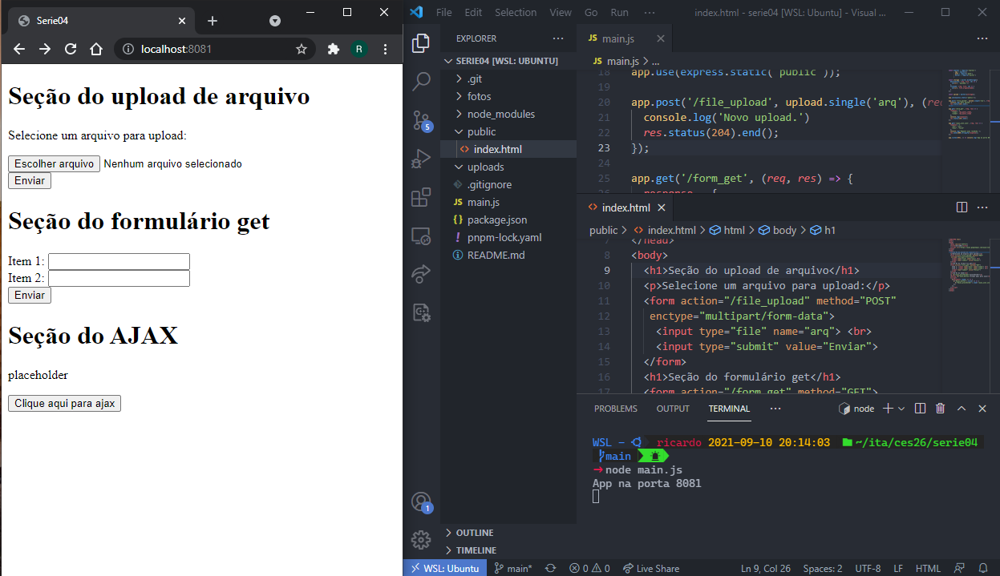
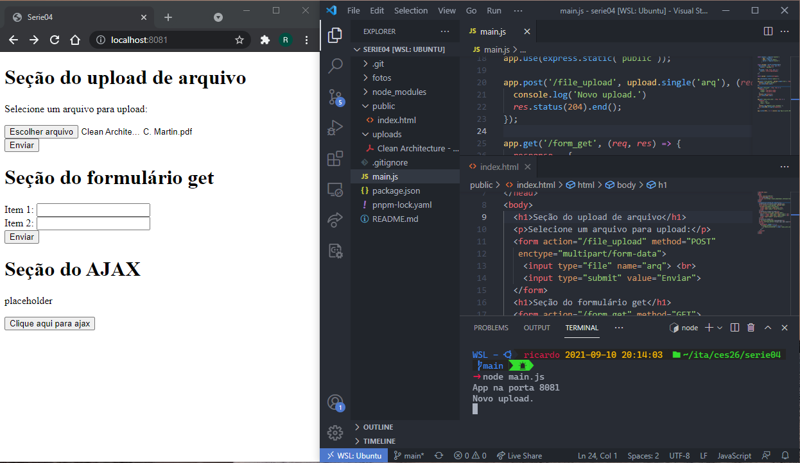
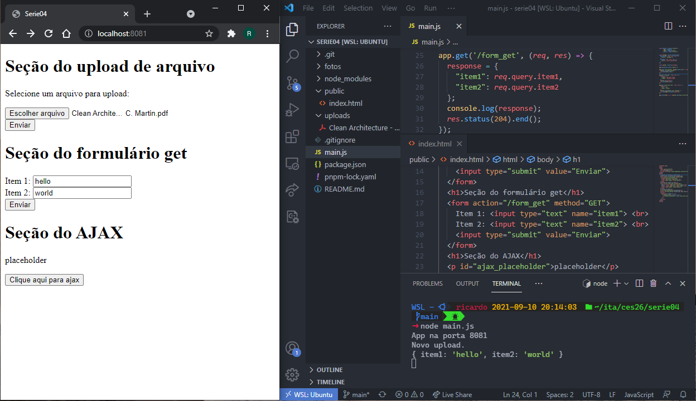
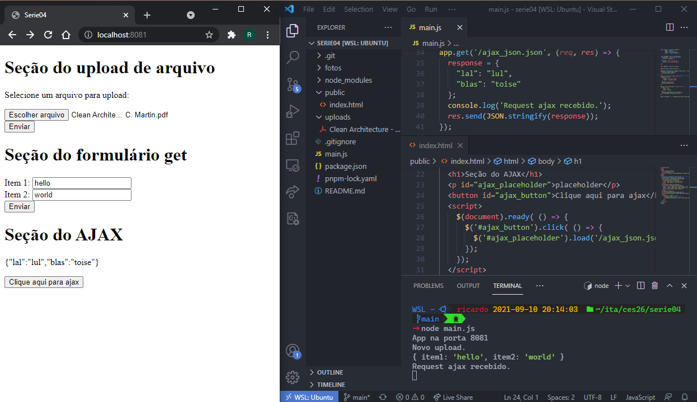

# ces26serie04 - Relatório
### Aluno: Ricardo Macedo Pacheco

___

Figura 1: Momento logo após a inicialização do servidor e acesso pelo navegador.
A página index.html, mesmo não estando na raiz, é servida devido à inclusão de 
seu diretório na lista de diretórios de arquivos estáticos. Note que o diretório
uploads encontra-se vazio.
___

Figura 2: Após a seleção de um arquivo e apertar o botão "Enviar", o diretório
uploads recebe uma cópia deste arquivo e uma mensagem de aviso é exibida no
terminal.
___

Figura 3: Após a inserção de "hello" e "world" nos campos do formulário e o
subsequente envio, é impressa uma mensagem de aviso no terminal contendo o valor
dos campos enviados.
___

Figura 4: Após clicar no botão da seção do ajax, o conteúdo de um objeto
hardcoded no servidor é enviado e exibido no cliente. Há também a impressão de
uma mensagem no terminal indicando que isso ocorreu.